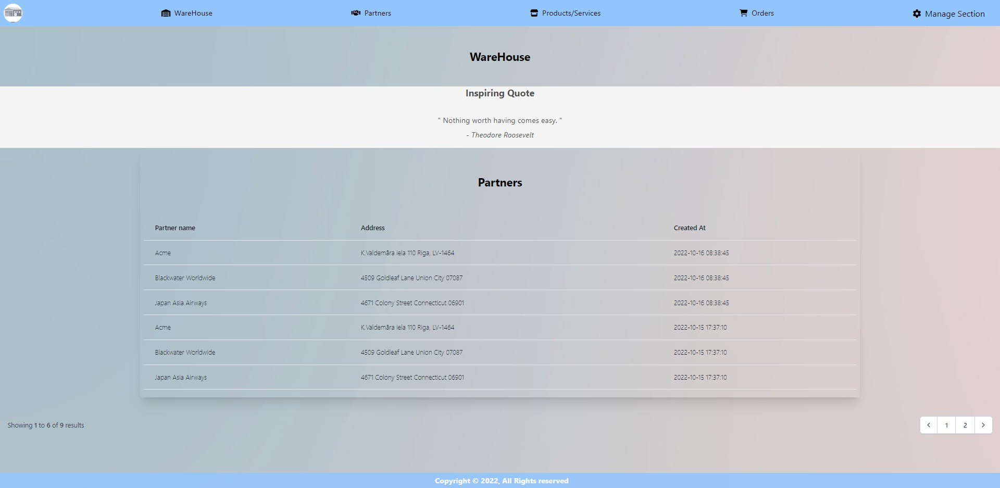
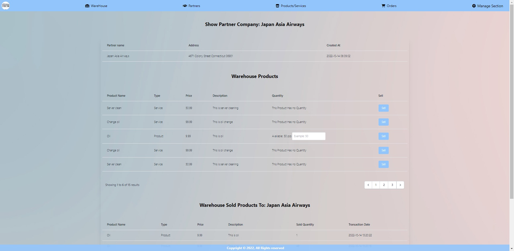
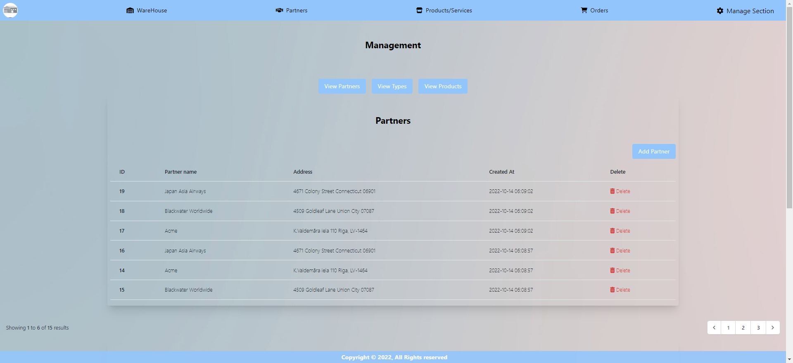

# Warehouse Register App

# Used PHP 8/PHP Extensions For Laravel and etc/Laravel 9/Tailwind 3 CDN/ Alpine.js 2.8.2 CDN/MySql 8


---

## Main Page



---

---

## Sell Page



---
---

## Manage Page



---

# Requirements:

### Git
### Code Editor PHPStorm or any other
### Mysql
### Composer
### PHP
### PHP Extensions like: BCMath, Ctype, JSON, Mbstring, OpenSSL, PDO, Tokenizer, and XML

---

# How To Set up:

## Execute commands specified in terminal successfully:


### 1. In your chosen directory open terminal app
#### Terminal should be open in chosen directory root!

### 2. Initialize Git to your chosen directory with this command:

```

git init

```

### 3. Clone or download with Git to your chosen directory with this command:

```

git pull https://github.com/jbumaniss/CatchSmart.git

```

### 4. Open chosen directory root with your chosen editor.

### 5. Rename .env.example file from your chosen directory root to .env in same directory with this command:

```

cp .env.example .env

```


### 6. Next fill the renamed .env file from your app core directory with your credentials:

#### a.DB_HOST=your_mysql_ip_address
#### b.DB_DATABASE=your_databases_name
#### c.DB_USERNAME=your_mysql_database_username
#### d.DB_PASSWORD=your_mysql_database_password if is set if not leave empty

### 7. Run composer install to install required packages

```
composer install
```

#### if command is failed because of requirements, try this command instead:

```
composer install --ignore-platform-reqs
```

### 8. Generate app key with this command:

```
php artisan key:generate
```

### 9. Migrate database migrations to fill your database with all the necessary tables and columns:

```
php artisan migrate
```
#### a. As database does not exist in MySql database, terminal will ask you to make new database: type `yes` and hit enter

---

## Create new database


---

### 10. NOT REQUIRED! Populate database with fake table data:

```
php artisan db:seed
```

### 11. Run the App command:

````
php artisan serv
````

---

## Development Server


---

### 12. Open your browser and navigate to http://127.0.0.1:8000:
####  or if in your terminal is written different address navigate to it in your favorite web browser
####  or for shortcut press ctrl and left mouse button in your terminal on your generated address should open browser with served page

---

